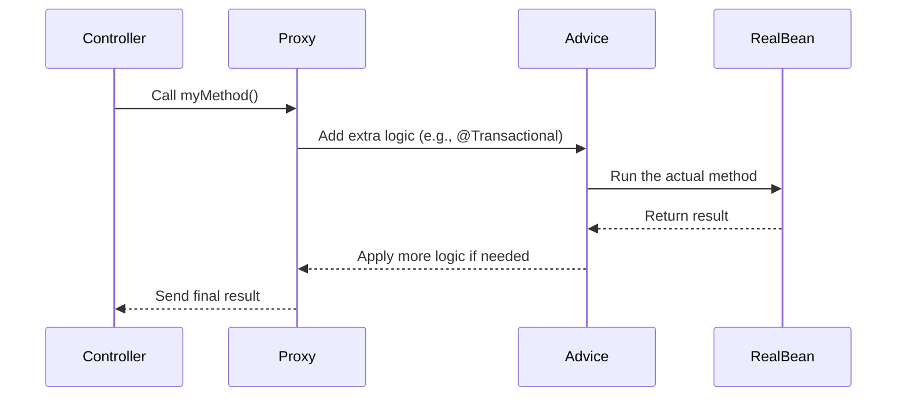
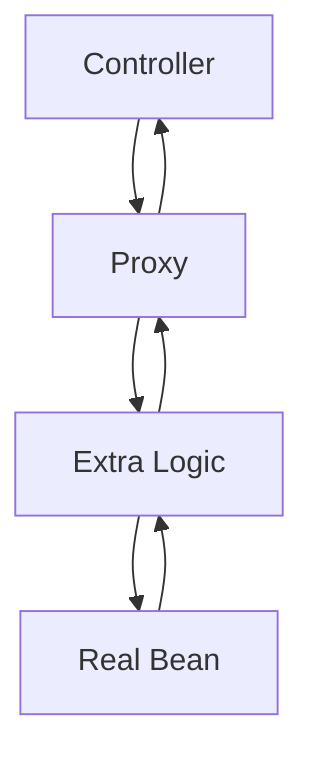
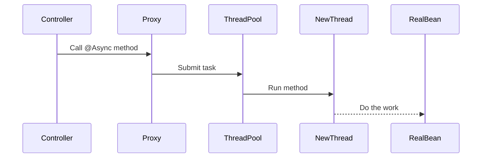

## What is a Proxy?

A proxy is like a middleman that sits between you and the actual object (a Spring bean). It adds extra functionality, like logging or transaction management, before or after calling the real method.

📌 In simple words: **A proxy is a helper that wraps your code to add special behavior.**

##
Spring uses proxies to add "magic" to your code without you needing to write it. For example:

📍Transactions (@Transactional): Ensures database operations are saved or rolled back correctly.

📍Async execution (@Async): Runs methods in a separate thread for better performance.

📍Caching: Stores results to avoid repeating work.

📍Security: Checks permissions before running a method.

📍Lazy Loading: Loads data only when needed (e.g., in Hibernate).

↪️ How it works: When you call a method on a Spring bean, you’re actually calling the proxy. The proxy decides what to do before or after the real method runs.
##

##  Types of Proxies in Spring

Spring creates proxies in **two ways**:

| Proxy Type         | When Used                          | How It Works                                |
|--------------------|------------------------------------|---------------------------------------------|
| **JDK Dynamic Proxy** | If your class implements an interface | The proxy pretends to be the interface.      |
| **CGLIB Proxy**       | If your class doesn’t have an interface | The proxy creates a subclass at runtime.     |

 **Tip:** Always use interfaces (e.g., `MyService`) to make proxies work smoothly.

---

##  How a Proxy Works 


The diagram shows how a method call flows in Spring Boot using a proxy.

The Controller starts by calling a method, which goes to the Proxy first.

The Proxy passes it to Advice to add extra logic (like @Transactional), then to the RealBean to execute.

The result returns through Advice and Proxy back to the Controller.

---

##  Proxy Limitations (What Doesn’t Work?)

| Problem              | Why It Happens                                                                 |
|----------------------|--------------------------------------------------------------------------------|
| **Self-invocation**  | Calling a method from the same class (e.g., `this.myMethod()`) skips the proxy |
| **Private methods**  | Proxies can't intercept private methods                                        |
| **Final methods**    | Proxies can't override final methods                                           |
| **Non-Spring beans** | If you create an object with `new`, Spring can’t add a proxy                  |
| **Direct calls**     | Proxies only work when called from outside the class                          |

📌 **Example – Self-invocation fails:**
```java
@Service
public class MyService {
    @Transactional
    public void outerMethod() {
        this.innerMethod(); // ❌ Proxy is bypassed – no transaction!
    }

    @Transactional
    public void innerMethod() {
        // DB operations here
    }
}
```

---

##   Common Use Cases

###  A. `@Transactional`

- **What it does:** Manages DB transactions (commit/rollback).
- **How it works:** Proxy starts transaction before the method, and commits/rolls back afterward.
- ⚠️ Works **only** when method is called **from outside** the class.

📌 **Example:**
```java
@Service
public class MyService {
    @Transactional
    public void saveData() {
        // DB logic – auto rollback on error
    }
}
```

❌ Doesn’t work if:
- Method is `private` or `final`
- Called via `this.saveData()` inside same class

---

### B. `@Async`

- **What it does:** Runs method in a different thread to speed things up.
- **How it works:** Proxy hands off method to thread pool executor.

📌 **Example:**
```java
@Service
public class MyService {
    @Async
    public void sendEmail() {
        // Runs in a background thread
    }
}
```

❌ Doesn’t work if:
- Method is called via `this.sendEmail()` inside same class
- Bean is not managed by Spring
- Exception is thrown before returning `CompletableFuture`

📌 **Using custom thread pool:**
```java
@Configuration
public class AsyncConfig {
    @Bean(name = "customExecutor")
    public Executor taskExecutor() {
        ThreadPoolTaskExecutor executor = new ThreadPoolTaskExecutor();
        executor.setCorePoolSize(5);
        executor.setMaxPoolSize(10);
        executor.setQueueCapacity(25);
        executor.initialize();
        return executor;
    }
}
```

```java
@Service
public class MyService {
    @Async("customExecutor")
    public void sendEmail() {
        // Runs with custom thread pool
    }
}
```

---

## Proxy Behavior in Action

| Scenario                              | Proxy Works? | Why                                           |
|---------------------------------------|--------------|-----------------------------------------------|
| `this.myMethod()`                     | ❌           | Skips proxy                                   |
| Method called from controller         | ✅           | Goes through proxy                            |
| `@Async` with `CompletableFuture`     | ✅           | Proxy handles it correctly                    |
| Exception thrown before return        | ❌           | Proxy can't catch it – no async behavior      |

---

###  Normal Proxy Call



###  Async Thread Switch


The diagram shows how an @Async method works in Spring Boot.

The Controller calls the method, and the Proxy submits it to the ThreadPool.

The ThreadPool assigns it to a NewThread, which runs the method in the RealBean.

This allows the task to run in the background without blocking the Controller.

---

Follow these practices to master proxy behavior and avoid common pitfalls☠️!
