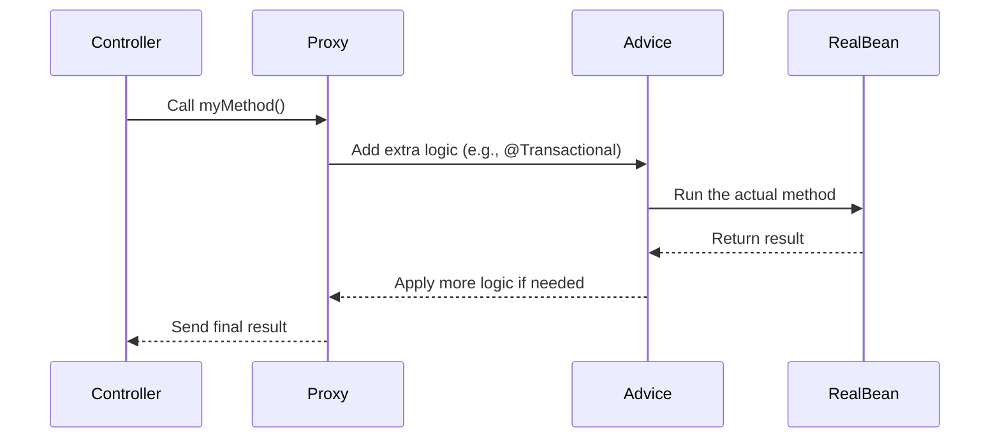
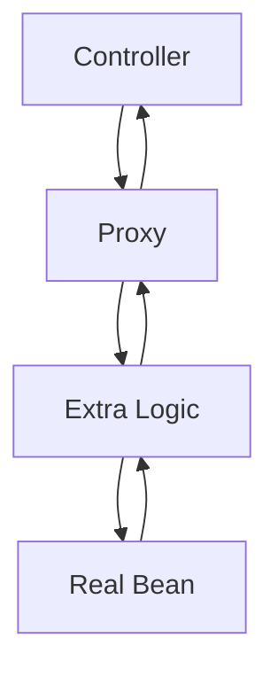
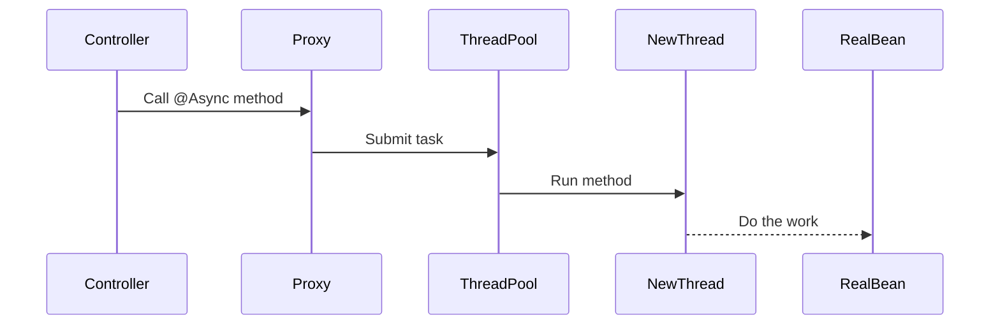
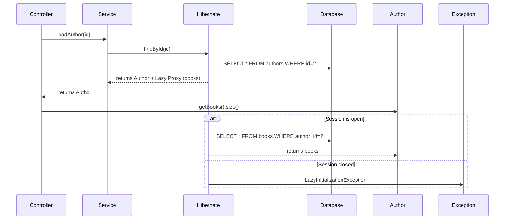

## What is a Proxy?

A proxy is like a middleman that sits between you and the actual object (a Spring bean). It adds extra functionality, like logging or transaction management, before or after calling the real method.

📌 In simple words: **A proxy is a helper that wraps your code to add special behavior.**

##
Spring uses proxies to add "magic" to your code without you needing to write it. For example:

📍Transactions (@Transactional): Ensures database operations are saved or rolled back correctly.

📍Async execution (@Async): Runs methods in a separate thread for better performance.

📍Caching: Stores results to avoid repeating work.

📍Security: Checks permissions before running a method.

📍Lazy Loading: Loads data only when needed (e.g., in Hibernate).

↪️ How it works: When you call a method on a Spring bean, you’re actually calling the proxy. The proxy decides what to do before or after the real method runs.
##

##  Types of Proxies in Spring

Spring creates proxies in **two ways**:

| Proxy Type         | When Used                          | How It Works                                |
|--------------------|------------------------------------|---------------------------------------------|
| **JDK Dynamic Proxy** | If your class implements an interface | The proxy pretends to be the interface.      |
| **CGLIB Proxy**       | If your class doesn’t have an interface | The proxy creates a subclass at runtime.     |

 **Tip:** Always use interfaces (e.g., `MyService`) to make proxies work smoothly.

---

##  How a Proxy Works 


The diagram shows how a method call flows in Spring Boot using a proxy.

The Controller starts by calling a method, which goes to the Proxy first.

The Proxy passes it to Advice to add extra logic (like @Transactional), then to the RealBean to execute.

The result returns through Advice and Proxy back to the Controller.

---

##  Proxy Limitations (What Doesn’t Work?)

| Problem              | Why It Happens                                                                 |
|----------------------|--------------------------------------------------------------------------------|
| **Self-invocation**  | Calling a method from the same class (e.g., `this.myMethod()`) skips the proxy |
| **Private methods**  | Proxies can't intercept private methods                                        |
| **Final methods**    | Proxies can't override final methods                                           |
| **Non-Spring beans** | If you create an object with `new`, Spring can’t add a proxy                  |
| **Direct calls**     | Proxies only work when called from outside the class                          |

📌 **Example – Self-invocation fails:**
```java
@Service
public class MyService {
    @Transactional
    public void outerMethod() {
        this.innerMethod(); // ❌ Proxy is bypassed – no transaction!
    }

    @Transactional
    public void innerMethod() {
        // DB operations here
    }
}
```

---

##   Common Use Cases

###  A. `@Transactional`

- **What it does:** Manages DB transactions (commit/rollback).
- **How it works:** Proxy starts transaction before the method, and commits/rolls back afterward.
- ⚠️ Works **only** when method is called **from outside** the class.

📌 **Example:**
```java
@Service
public class MyService {
    @Transactional
    public void saveData() {
        // DB logic – auto rollback on error
    }
}
```

❌ Doesn’t work if:
- Method is `private` or `final`
- Called via `this.saveData()` inside same class

---

### B. `@Async`

- **What it does:** Runs method in a different thread to speed things up.
- **How it works:** Proxy hands off method to thread pool executor.

📌 **Example:**
```java
@Service
public class MyService {
    @Async
    public void sendEmail() {
        // Runs in a background thread
    }
}
```

❌ Doesn’t work if:
- Method is called via `this.sendEmail()` inside same class
- Bean is not managed by Spring
- Exception is thrown before returning `CompletableFuture`

📌 **Using custom thread pool:**
[custom thread pool](https://github.com/hanin-mohamed/Sprinkles-of-Spring/blob/main/proxy-lab/src/main/java/com/spring/proxylab/async/config/AsyncConfig.java)


```java
@Service
public class MyService {
    @Async("customExecutor")
    public void sendEmail() {
        // Runs with custom thread pool
    }
}
```

---

## Proxy Behavior in Action

| Scenario                              | Proxy Works? | Why                                           |
|---------------------------------------|--------------|-----------------------------------------------|
| `this.myMethod()`                     | ❌           | Skips proxy                                   |
| Method called from controller         | ✅           | Goes through proxy                            |
| `@Async` with `CompletableFuture`     | ✅           | Proxy handles it correctly                    |
| Exception thrown before return        | ❌           | Proxy can't catch it – no async behavior      |

---

###  Normal Proxy Call



###  Async Thread Switch


The diagram shows how an @Async method works in Spring Boot.

The Controller calls the method, and the Proxy submits it to the ThreadPool.

The ThreadPool assigns it to a NewThread, which runs the method in the RealBean.

This allows the task to run in the background without blocking the Controller.

---

#  Hibernate Lazy Proxy in Spring


##  What is Lazy Loading?

**Lazy Loading** means:

> Hibernate will not load related data (e.g., collections or associations) until you access it.

Instead of returning the real data (like a list of books), Hibernate returns a **proxy object** that delays loading until needed.

📌 Example:
```java
@OneToMany(mappedBy = "author", fetch = FetchType.LAZY)
private List<Book> books;

Author author = repo.findById(1L).orElseThrow();
// No query for books yet

author.getBooks(); // triggers SQL
```

---

##  What Is a Hibernate Lazy Proxy?

Hibernate creates a proxy class (like `PersistentBag`) that:

-  Delays loading actual data  
-  Holds reference to the Hibernate **Session**  
-  Loads data when `.size()`, `.get()`, or `.iterator()` is called  

---

##  When Does It Work?

| Situation                           | Works? | Reason                                 |
|-------------------------------------|--------|----------------------------------------|
| Inside `@Transactional`             | ✅     | Session is still open                  |
| Inside controller (`open-in-view`)  | ✅     | Session kept open for request          |
| After transaction ends              | ❌     | Session closed = proxy fails           |
| After entity serialization          | ❌     | Session reference lost in JSON         |

---

##  Why Does It Fail?

Hibernate proxies depend on an active `Session`. If closed:

```java
System.out.println(author.getBooks().size());
```

You get:

```bash
LazyInitializationException: could not initialize proxy – no Session
```

 Internally:
```java
if (this.session == null || !this.session.isOpen()) {
    throw new LazyInitializationException("No Session");
}
```

---

##  Hibernate Lazy Proxy 



The sequence diagram shows how Lazy Loading works:

The Controller asks the Service to load an Author by id.
The Service uses Hibernate to fetch the Author from the Database, returning it with a Lazy Proxy for books.
When getBooks().size() is called, if the Session is open, Hibernate fetches the books data; if closed, it throws a LazyInitializationException.

---

##  Common Fixes

| Strategy              | Description                                          |
|-----------------------|------------------------------------------------------|
| `@Transactional`      |  Keeps the Hibernate Session open during the operation, allowing the Lazy Proxy to fetch data safely when needed.                    |
| `join fetch`          | Fetches related data (e.g., books) along with the parent (e.g., Author) in a single database call, avoiding multiple queries                |
| DTO projection        | Fetch only what you need: Creates a custom object with just the required fields, bypassing the Lazy Proxy and preventing session issues.                           |
| `@EntityGraph`        | Control eager loading declaratively: Defines which relationships to load eagerly using annotations, giving fine-tuned control over data fetching.                  |
| `open-in-view=true`   | (Caution) Keeps session open for web requests: Extends the Hibernate Session throughout the web request, but it may impact performance.       |
| `fetch = EAGER`       | Always load with parent (not recommended for large collections): Forces Hibernate to load related data immediately with the parent, which can slow down the app if the data is big. |

---

# Spring Events & Proxy Behavior

> Spring provides a powerful **event-driven model** that allows components to communicate without being tightly coupled.  
> But under the hood, it **relies on proxies** and **Spring-managed beans** to work properly.

---

## What Are Spring Events?

- A **publisher** can fire an event using `ApplicationEventPublisher`.
- Any **listener** annotated with `@EventListener` will handle the event.
- Add `@Async` on listeners to process events **asynchronously** in a different thread.

---

##  Why Do Proxies Matter?

For `@EventListener` and `@Async` to work:

✅ The listener **must be a Spring-managed bean** (e.g., annotated with `@Component`, `@Service`, etc.).  
    If you create the object manually using `new`, **no proxy is created**, and **it won’t work**.

---
### 📍 Event Class [Event Class](https://github.com/hanin-mohamed/Sprinkles-of-Spring/blob/main/proxy-lab/src/main/java/com/spring/proxylab/event/model/CustomEvent.java)


### 📍 Valid Listener (Spring-managed) [Valid Listener](https://github.com/hanin-mohamed/Sprinkles-of-Spring/blob/main/proxy-lab/src/main/java/com/spring/proxylab/event/listener/CustomEventListener.java)

> This works because Spring wraps the bean in a **proxy**, enabling both `@EventListener` and `@Async`.
> Note: `@Async` makes the listener run on a separate thread (e.g., `pool-1-thread-1`).


### 📍 Invalid Listener (Manual object – No Proxy) [Invalid Listener](https://github.com/hanin-mohamed/Sprinkles-of-Spring/blob/main/proxy-lab/src/main/java/com/spring/proxylab/event/listener/ManualListener.java)
> Even if defined as a `@Bean`, it **won’t work** unless it's also proxied (e.g., via `@EnableAspectJAutoProxy`).

### 📍 Event Publisher [Event Publisher](https://github.com/hanin-mohamed/Sprinkles-of-Spring/blob/main/proxy-lab/src/main/java/com/spring/proxylab/event/publisher/EventPublisher.java)


---

##  Why Proxy Matters

| Feature          | Needs Proxy | Works with `new`? | Works with `@Bean`?             |
|------------------|-------------|-------------------|----------------------------------|
| `@EventListener` | ✅ Yes      | ❌ No             | ❌ No (unless proxied manually)  |
| `@Async`         | ✅ Yes      | ❌ No             | ❌ No (unless proxied manually)  |

- `@EventListener` and `@Async` are implemented via **Spring AOP**.
- Without a proxy, Spring **won’t detect or intercept** the method.
- The proxy handles both **event dispatching** and **thread management**.

---

#  Spring AOP (Aspect-Oriented Programming)

Spring AOP is a powerful tool in the Spring Framework that helps you handle **cross-cutting concerns**—like logging, security, or performance tracking—without cluttering your main business logic. Instead of repeating code in many places, AOP lets you write it once and apply it when needed.

---

##  Why Use AOP?

- **Keep Code Clean:** Keeps extra responsibilities separate from the core logic.
- **Promote Reusability:** Write once, reuse in multiple places (e.g., logging).
- **Simplify Maintenance:** Update concerns like security or logging in one place.
- **Add Flexibility:** Enable/disable behaviors without touching core business code.

---

##  Where to Use It?

- **Service Layer:** Transaction management, business event logging  
- **Controller Layer:** Security checks, request tracking  
- **Repository/Data Layer:** Retry logic, performance monitoring  

---

##  When to Use It?

- You need to apply the same action to multiple methods (e.g., logging, auth).
- You need centralized security, performance, or transaction logic.
- You want centralized error handling or logging.

---

##  Common Use Cases

- **Logging:** Record when a method starts, ends, or fails.
- **Security:** Restrict access to specific users/roles.
- **Transactions:** Ensure database operations are consistent.
- **Error Handling:** Log and handle exceptions globally.

---

##  How Does AOP Work?

AOP weaves extra logic (**advice**) into your existing code at specific points (**join points**). Below are the core concepts:

- **Aspect:** A class that contains cross-cutting logic.
- **Advice:** Code that runs at a specific point (e.g., before a method).
  - `@Before`, `@AfterReturning`, `@AfterThrowing`, `@After`, `@Around`
- **Pointcut:** A rule for where the advice should apply.
- **Join Point:** The actual execution point (e.g., method call).
- **Target:** The object being advised (e.g., your service/controller).

---

###  AOP Process Flow

```text
        Client
          │
          ▼
     [Proxy Object]  <-- Spring creates this
          │
   ┌──────┴────────────┐
   │ Check Pointcut    │
   │  ↳ Is it a match? │
   └──────┬────────────┘
          │ Yes
          ▼
     Apply Advice
   (before, around, after...)
          │
          ▼
     Call Real Method
```

---

##  Why Proxies Are Important

Spring AOP uses proxies to intercept method calls and apply aspects without modifying your original code.

---

##  Enabling Spring AOP

To activate AOP in your project, you need:

- Configuration to enable proxying
- An `@Aspect` class
- Target methods with matching pointcuts

###  Example Classes

-  [AOP Config](https://github.com/hanin-mohamed/Sprinkles-of-Spring/blob/main/proxy-lab/src/main/java/com/spring/proxylab/aop/config/AopConfig.java)  
-  [Aspect Class](https://github.com/hanin-mohamed/Sprinkles-of-Spring/blob/main/proxy-lab/src/main/java/com/spring/proxylab/aop/aspect/AopAspect.java)  
-  [AOP Service](https://github.com/hanin-mohamed/Sprinkles-of-Spring/blob/main/proxy-lab/src/main/java/com/spring/proxylab/aop/service/AopService.java)  
-  [AOP Controller](https://github.com/hanin-mohamed/Sprinkles-of-Spring/blob/main/proxy-lab/src/main/java/com/spring/proxylab/aop/controller/AopController.java)

---

